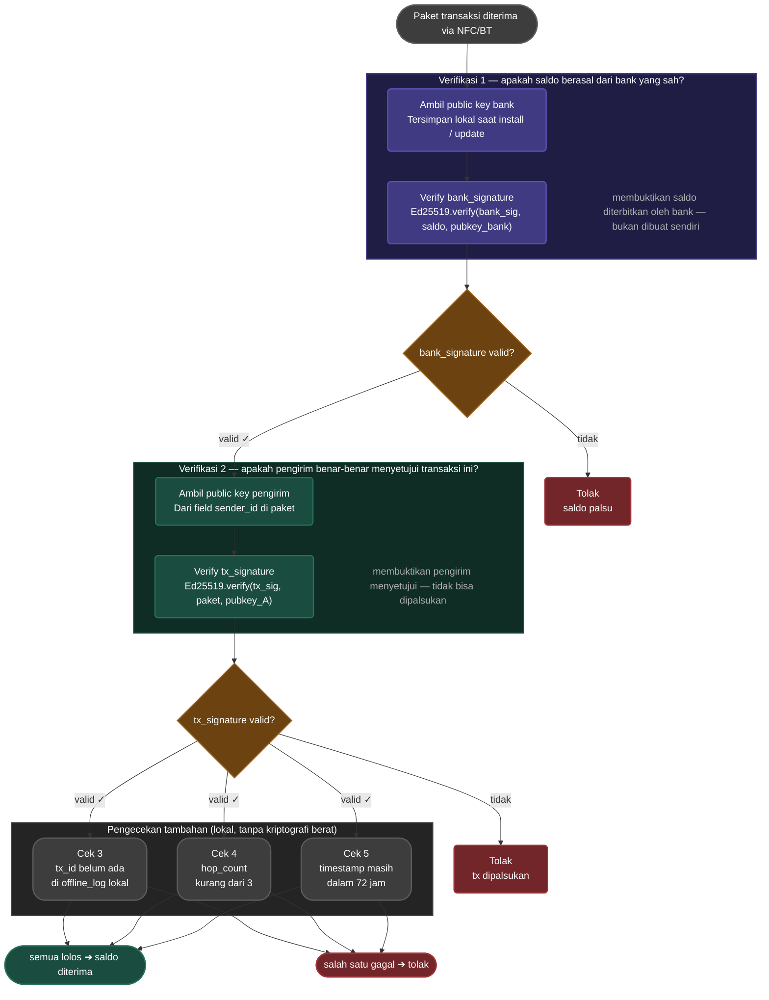

```mermaid
flowchart TD
    A(["Paket transaksi diterima via NFC/BT"]) --> V1_1

    subgraph Verifikasi1["Verifikasi 1 — apakah saldo berasal dari bank yang sah?"]
        V1_1["Ambil public key bank<br/>Tersimpan lokal saat install / update"] --> V1_2["Verify bank_signature<br/>Ed25519.verify(bank_sig, saldo, pubkey_bank)"]
        V1_text["membuktikan saldo diterbitkan oleh bank — bukan dibuat sendiri"]
    end

    V1_2 --> D1{"bank_signature valid?"}
    D1 -- tidak --> E1["Tolak<br/>saldo palsu"]
    D1 -- valid ✓ --> V2_1

    subgraph Verifikasi2["Verifikasi 2 — apakah pengirim benar-benar menyetujui transaksi ini?"]
        V2_1["Ambil public key pengirim<br/>Dari field sender_id di paket"] --> V2_2["Verify tx_signature<br/>Ed25519.verify(tx_sig, paket, pubkey_A)"]
        V2_text["membuktikan pengirim menyetujui — tidak bisa dipalsukan"]
    end

    V2_2 --> D2{"tx_signature valid?"}
    D2 -- tidak --> E2["Tolak<br/>tx dipalsukan"]
    D2 -- valid ✓ --> C3 & C4 & C5

    subgraph PengecekanTambahan["Pengecekan tambahan (lokal, tanpa kriptografi berat)"]
        C3["Cek 3<br/>tx_id belum ada<br/>di offline_log lokal"]
        C4["Cek 4<br/>hop_count<br/>kurang dari 3"]
        C5["Cek 5<br/>timestamp masih<br/>dalam 72 jam"]
    end

    C3 & C4 & C5 --> L1(["semua lolos ➔ saldo diterima"])
    C3 & C4 & C5 --> L2(["salah satu gagal ➔ tolak"])

    classDef normal fill:#1A4C40,stroke:#26735A,stroke-width:2px,color:#FFFFFF,rx:5px,ry:5px
    classDef action fill:#403A82,stroke:#5A52B5,stroke-width:2px,color:#FFFFFF,rx:5px,ry:5px
    classDef decision fill:#6B4210,stroke:#965D16,stroke-width:2px,color:#FFFFFF,rx:5px,ry:5px
    classDef error fill:#73262A,stroke:#A1353B,stroke-width:2px,color:#FFFFFF,rx:5px,ry:5px
    classDef terminal fill:#3D3D3D,stroke:#5C5C5C,stroke-width:2px,color:#FFFFFF,rx:20px,ry:20px
    classDef textNode fill:none,stroke:none,color:#B0B0B0

    class A,C3,C4,C5 terminal
    class V1_1,V1_2 action
    class V2_1,V2_2 normal
    class D1,D2 decision
    class E1,E2,L2 error
    class L1 normal
    class V1_text,V2_text textNode

    style Verifikasi1 fill:#201D45,stroke:#403A82,stroke-width:2px,color:#FFFFFF
    style Verifikasi2 fill:#0F2D25,stroke:#1A4C40,stroke-width:2px,color:#FFFFFF
    style PengecekanTambahan fill:#242424,stroke:#3D3D3D,stroke-width:2px,color:#FFFFFF
```

